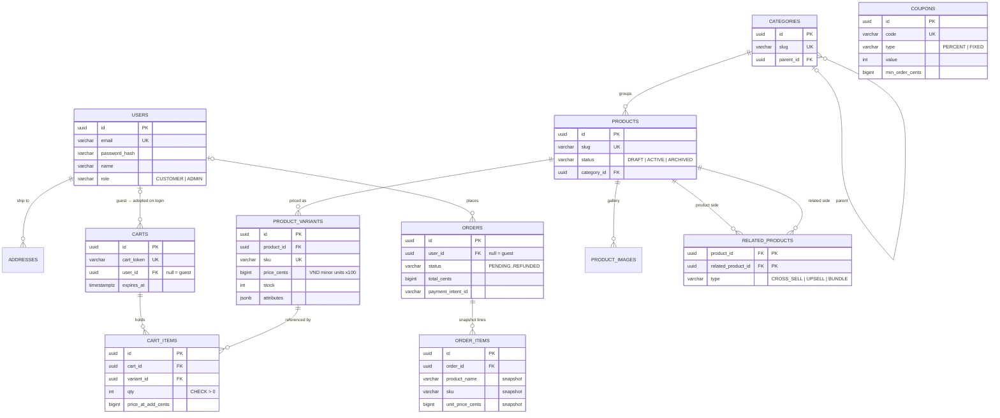
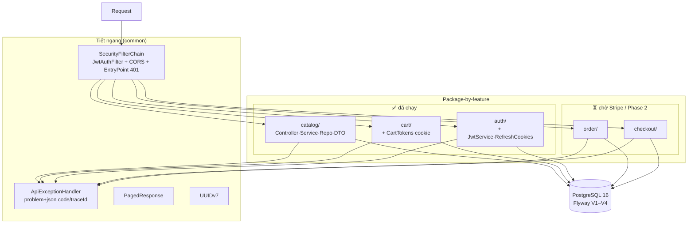
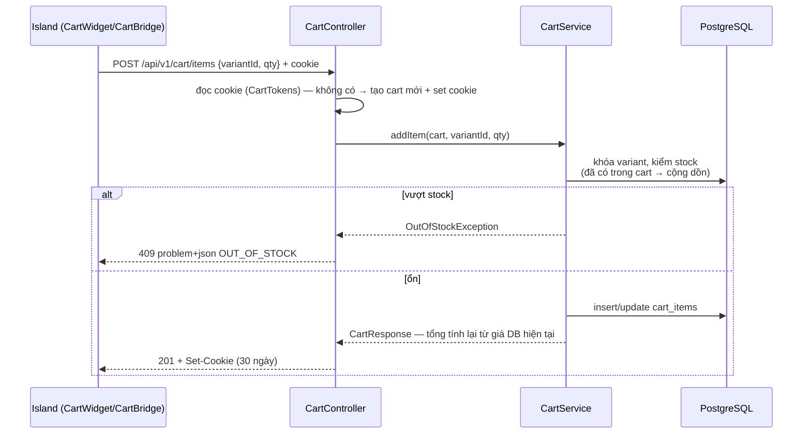
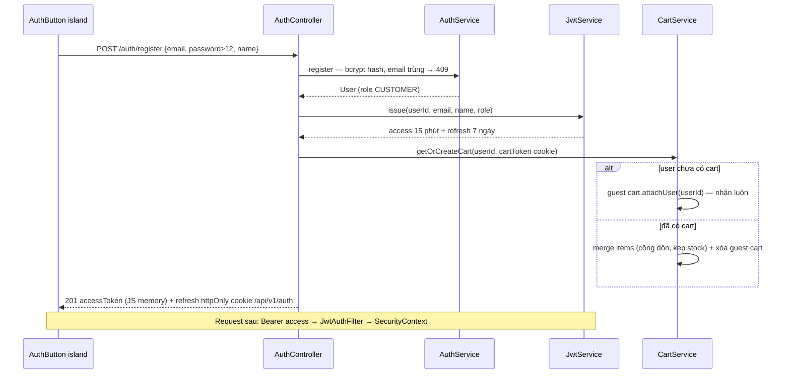

# Backend Architecture — myshop API

Trực quan hóa `apps/api` (Spring Boot 4.1, Java 21): quan hệ bảng, phân tầng, và các
luồng request chính. Nguồn sự thật: Flyway V1–V4 + code trong `com.shop.*`.

## 1. Quan hệ bảng (ERD)



Ghi chú thiết kế:

- **Tiền = `bigint` minor units** (ADR 0003: VND ×100), không bao giờ float — CHECK
  `price_cents >= 0`, `qty > 0` ngay ở DB.
- **`order_items` không FK về products/variants** — chụp `name/sku/unit_price` tại
  thời điểm mua; đổi/xóa sản phẩm sau này không làm hỏng đơn cũ.
- **`carts.user_id` nullable** — guest cart tồn tại trước user; login/register nhận
  cart (hoặc merge + kẹp theo stock) qua `CartService.getOrCreateCart(userId, token)`.
- **`related_products`** là self N–N có type — nền cho Phase 2 upsell.
- UUID do app sinh (UUIDv7 sortable, `common/uuid/Ids`); DB chỉ `gen_random_uuid()`
  làm phòng hờ.

## 2. Phân tầng & package (package-by-feature)



Luật tầng (AGENTS.md): Controller không business logic → Service không biết HTTP →
Repository chỉ query. Controller **không bao giờ** trả entity — map qua DTO record.
Mỗi list endpoint dùng chung envelope `PagedResponse` (page/size/totalElements).

## 3. Luồng request tiêu biểu

### 3.1 Đọc catalog (public, không state)

```mermaid
sequenceDiagram
    participant W as Astro (build/dev)
    participant F as JwtAuthFilter
    participant C as ProductController
    participant S as CatalogService
    participant R as Repositories
    W->>F: GET /api/v1/products?size=12&sort=newest
    F->>C: permitAll, không có Bearer → guest
    C->>S: listProducts(page, size, sort) — @Valid
    S->>R: ① page summaries (1 query, group-by min price)
    S->>R: ② images IN (productIds) — primary + hover
    S->>R: ③ variants IN (productIds) — defaultVariant + inStock
    R-->>S: 3 query — không N+1
    S-->>C: PagedResponse&lt;ProductSummaryResponse&gt; (DTO)
    C-->>W: 200 JSON — Zod parse ở web
```

### 3.2 Guest cart (cookie `cart_token`)



### 3.3 Auth + nhận guest cart



## 4. Phân phối phase theo module

| Module | Bảng | Trạng thái |
|---|---|---|
| `catalog` | categories, products, product_variants, product_images | ✅ đang chạy |
| `cart` | carts, cart_items | ✅ đang chạy (coupons áp vào CartMapper — Phase 2) |
| `auth` | users (+addresses chưa dùng) | ✅ đang chạy |
| `order` | orders, order_items | ⏳ chờ Stripe (hoãn theo PLAN §3) |
| `checkout` | — (Stripe + Idempotency-Key) | ⏳ chờ Stripe |
| upsell | coupons, related_products | ⏳ Phase 2 |

## 5. Runbook ngắn

- Dev: `./mvnw spring-boot:run` (8080) — Flyway auto migrate lúc boot, `ddl-auto=validate`.
- Test: `./mvnw verify` — unit + context test (cần Postgres local).
- Migrations: chỉ thêm `V{n}__*.sql` forward-only — không sửa file cũ (checksum).
